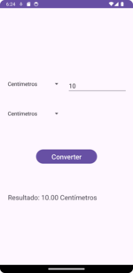

# Aplicativo de Conversão de Unidades métricas

Este é um aplicativo Android para converter unidades de medida, como centímetros, metros, quilômetros e milhas. O aplicativo permite que os usuários escolham qualquer combinação de unidades de entrada e saída para realizar a conversão.

## Funcionalidades

- **Conversão de Unidades:** Converta entre centímetros, metros, quilômetros e milhas.
- **Interface Intuitiva:** Selecione as unidades de entrada e saída utilizando Spinners.
- **Campo de Entrada:** Insira o valor a ser convertido em um campo EditText.
- **Resultado Instantâneo:** Veja o resultado da conversão imediatamente após clicar no botão "Convert".
- **Teclado Oculto:** O teclado é ocultado automaticamente quando o usuário clica fora do campo de entrada, proporcionando uma experiência de usuário mais limpa e sem distrações.

## Capturas de Tela




## Tecnologias Utilizadas

- **Kotlin:** Linguagem de programação utilizada para desenvolver o aplicativo.
- **Android Studio:** IDE usada para o desenvolvimento do projeto.
- **XML:** Utilizado para definir o layout da interface do usuário.
- **ConstraintLayout:** Utilizado para um layout responsivo e adaptável.
- **InputMethodManager:** Utilizado para gerenciar o teclado virtual.

## Estrutura do Projeto

```plaintext
.
├── app
│   ├── src
│   │   ├── main
│   │   │   ├── java
│   │   │   │   └── com
│   │   │   │       └── example
│   │   │   │           └── unitconverter
│   │   │   │               └── MainActivity.kt
│   │   │   ├── res
│   │   │   │   ├── layout
│   │   │   │   │   └── activity_main.xml
│   │   │   │   ├── values
│   │   │   │   │   └── strings.xml
│   │   │   │   └── drawable
│   │   └── AndroidManifest.xml
├── build.gradle
└── README.md
```

## Como Executar
  1. Clone o repositório:
```bash
git clone https://github.com/seu-usuario/unit-converter-app.git
```
  2. Abra o projeto no Android Studio.
  3. Conecte um dispositivo Android ou inicie um emulador.
  4. Compile e execute o aplicativo.

## Contribuições
Contribuições são bem-vindas! Sinta-se à vontade para abrir problemas (issues) ou enviar pull requests.

## Fork o repositório.
- Crie sua branch de funcionalidade (git checkout -b feature/AmazingFeature).
- Commit suas alterações (git commit -m 'Add some AmazingFeature').
- Push para a branch (git push origin feature/AmazingFeature).
- Abra um pull request.

## Licença
Este projeto está licenciado sob a licença MIT - veja o arquivo LICENSE para mais detalhes.

[](https://choosealicense.com/licenses/mit/)

Contato
@Andersonfreitas21 - andersonfreitas21@gmail.com

Link do Projeto:[ https://github.com/seu-usuario/unit-converter-app](https://github.com/Andersonfreitas21/conversor-unidades-metricas)
